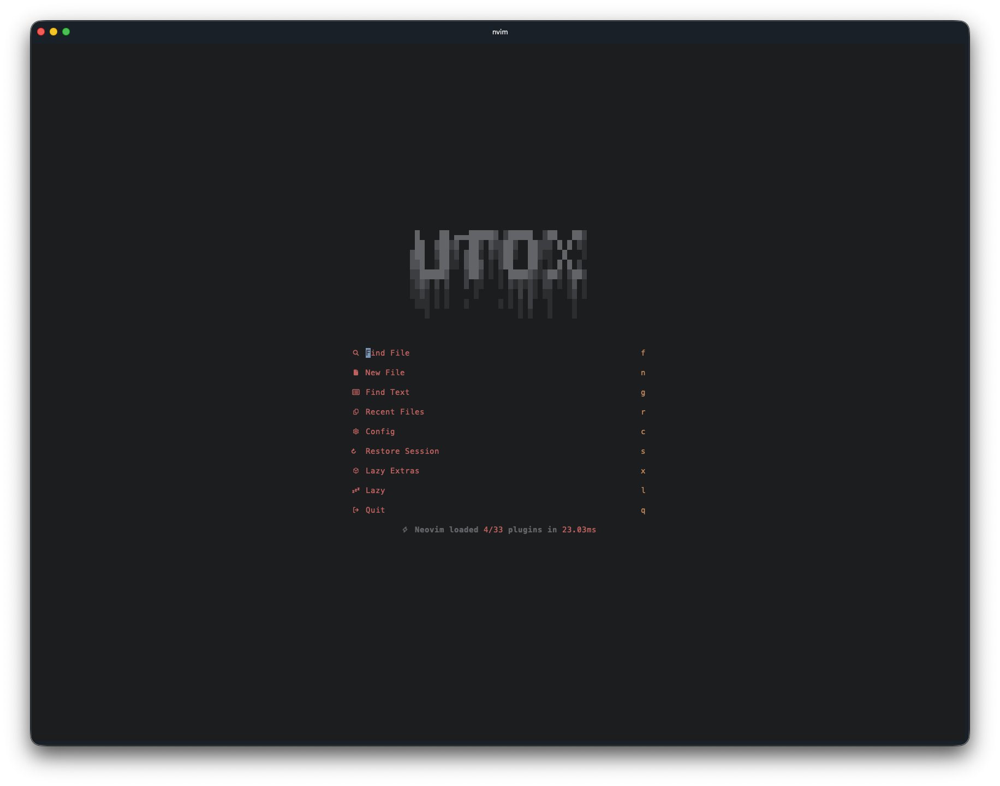
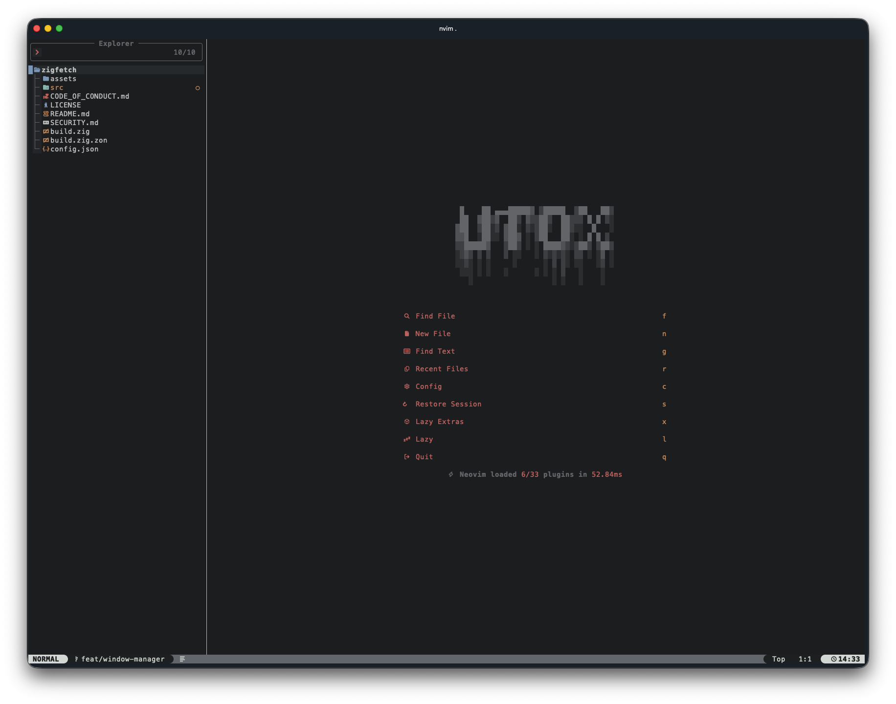
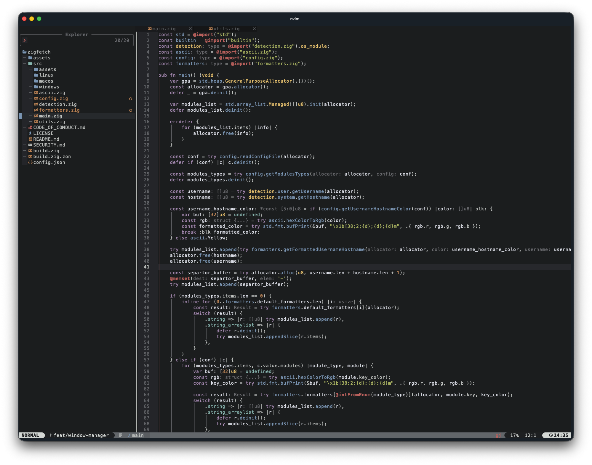
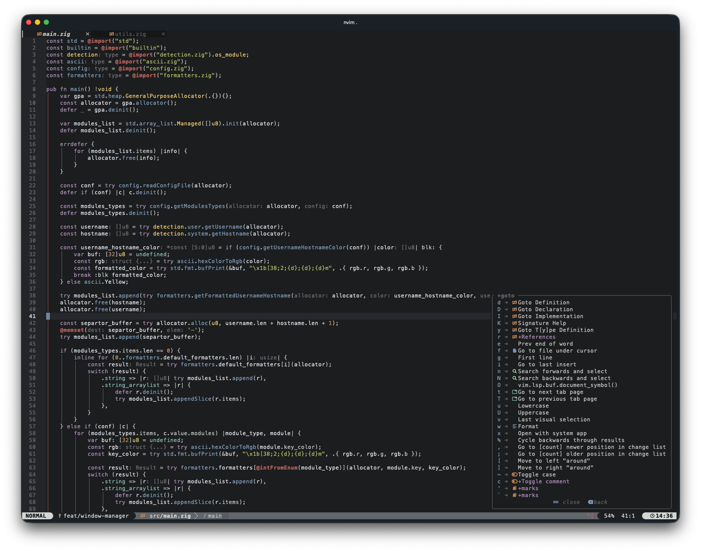

# tomorrow-night.nvim

> [!NOTE]
> This is a fork of [minimal.nvim](https://github.com/Yazeed1s/minimal.nvim).

A [TreeSitter](https://github.com/nvim-treesitter/nvim-treesitter) supported colorscheme inspired by base16-tomorrow-night.

## Features

- support the latest Neovim >=5.0 features like TreeSitter and LSP
- darker background for sidebar

### [Tomorrow Night in action]
   
   
   
   

## Plugin Support

- [TreeSitter](https://github.com/nvim-treesitter/nvim-treesitter)
- [Indent Blankline](https://github.com/lukas-reineke/indent-blankline.nvim)
- [Neo-tree](https://github.com/nvim-neo-tree/neo-tree.nvim)
- [Startify](https://github.com/mhinz/vim-startify)
- [Dashboard](https://github.com/glepnir/dashboard-nvim)
- [BufferLine](https://github.com/akinsho/nvim-bufferline.lua)
- [LSP Diagnostics](https://neovim.io/doc/user/lsp.html)
- [Git Signs](https://github.com/lewis6991/gitsigns.nvim)
- [Git Gutter](https://github.com/airblade/vim-gitgutter)
- [Neogit](https://github.com/TimUntersberger/neogit)
- [Telescope](https://github.com/nvim-telescope/telescope.nvim)
- [NvimTree](https://github.com/kyazdani42/nvim-tree.lua)
- [Barbar](https://github.com/romgrk/barbar.nvim)
- and more...

## Requirements

- Neovim >= 0.5.0

## Installation

You can Install the theme with any of the following package managers:

- [vim-plug](https://github.com/junegunn/vim-plug)

```vim
Plug 'utox39/tomorrow-night.nvim'
```

- [packer](https://github.com/wbthomason/packer.nvim)

```lua
use 'utox39/tomorrow-night.nvim'
```

- [lazy.nvim](https://github.com/folke/lazy.nvim)

```lua
return {
  "utox39/tomorrow-night.nvim",
  lazy = false,
  priority = 1000,

  {
    "LazyVim/LazyVim",
    opts = {
      colorscheme = "tomorrow-night",
    },
  },
}
```

## Usage

Enable the colorscheme:

```vim
" Vim Script
colorscheme tomorrow-night
```

```lua
-- Lua
vim.cmd[[colorscheme tomorrow-night]]
-- or, for lunarVim
lvim.colorscheme = 'tomorrow-night'
```
## ⚙️ Configuration

Note: set the configurations **BEFORE** you load the color scheme

| Option                     | Default   | Description              |
| -------------------------- | --------- | ------------------------ |
| minimal_italic_comments  | `true`    | Make comments italic     |
| minimal_italic_keywords  | `false`   | Make keywords italic     |
| minimal_italic_booleans  | `false`   | Make booleans italic     |
| minimal_italic_functions | `false`   | Make functions italic    |
| minimal_italic_variables | `false`   | Make variables italic    |
| minimal_transparent_background      | `false`   | Disable background color |


```lua
-- Example config in lua
vim.g.minimal_italic_functions = true
vim.g.minimal_italic_comments = false
-- Load the colorscheme
vim.cmd [[colorscheme tomorrow-night]]
```

```vim
" Example config in Vim Script
let g:minimal_italic_functions = 1
let g:minimal_italic_comments = 0
" Load the colorscheme
colorscheme tomorrow-night
```

## TODO:
- [x] Add color support for [neo-tree](https://github.com/nvim-neo-tree/neo-tree.nvim)
- [x] Add color support for [startify](https://github.com/mhinz/vim-startify)
- [ ] Add themes to statusLine plugins such as [feline](https://github.com/feline-nvim/feline.nvim) and [lualine](https://github.com/nvim-lualine/lualine.nvim)

## Contributing

If you would like to add support to a plugin or to fix a bug please feel free to send a PR.

## Credits
- [roshnivim-cs](https://github.com/Abstract-IDE/Abstract-cs)
- [sonokai](https://github.com/sainnhe/sonokai)
- [base16.vim]('chriskempson/base16-vim' )
- [minimal.vim](https://github.com/yazeed1s/minimal.nvim)
